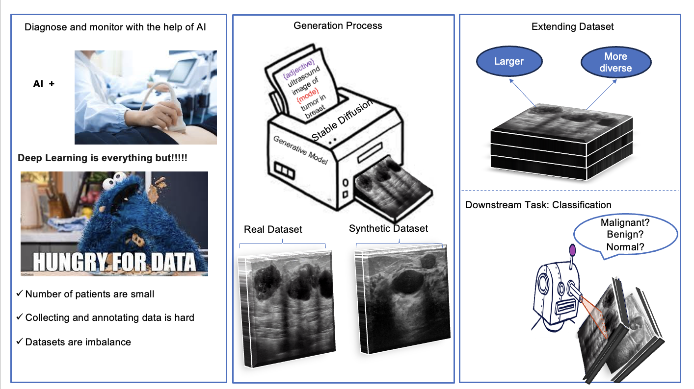

# 

<h1> MEDDAP: Medical Dataset Enhancement via Diversified Augmentation Pipeline </h1>
<h3>
Yasamin Medghalchi, Niloufar Zakariaei, Arman Rahmim, and Ilker Hacihaliloglu </h3>



The effectiveness of Deep Neural Networks (DNNs) heavily relies on the abundance and accuracy of available training data. However, collecting and annotating data on a large scale is often both costly and time-intensive, particularly in medical cases where practitioners are already occupied with their duties. Moreover, ensuring that the model remains robust across various scenarios of image capture is crucial in medical domains, especially when dealing with ultrasound images that vary based on the settings of different devices and the manual operation of the transducer.

To address this challenge, we introduce a novel pipeline called MEDDAP, which leverages Stable Diffusion (SD) models to augment existing small datasets by automatically generating new informative labeled samples. Pretrained checkpoints for SD are typically based on natural images, and training them for medical images requires significant GPU resources due to their heavy parameters. To overcome this challenge, we introduce USLoRA (Ultrasound Low-Rank Adaptation), a novel fine-tuning method tailored specifically for ultrasound applications. USLoRA allows for selective fine-tuning of weights within SD, requiring fewer than 0.1% of parameters compared to fully fine-tuning only the UNet portion of SD.

To enhance dataset diversity, we incorporate different adjectives into the generation process prompts, thereby desensitizing the classifiers to intensity changes across different images. This approach is inspired by clinicians' decision-making processes regarding breast tumors, where tumor shape often plays a more crucial role than intensity. In conclusion, our pipeline not only outperforms classifiers trained on the original dataset but also demonstrates superior performance when encountering unseen datasets.

## Method Pipeline
Please refer to the [paper]() for more technical details.

## Requirements

* Install necessary python libraries:
```bash
git clone https://github.com/huggingface/diffusers
cd diffusers
pip install .
cd examples/text_to_image
pip install -r requirements.txt
```
```bash
accelerate config -----> set the config based on your device
```
create account on hugging face and copy the access token for writing mode and paste the token when it is asked
```bash
pip install --upgrade huggingface_hub
huggingface-cli login 
```
## Prepairing Dataset
Make Dataset in Hugging face webpage in your account with your preferred name
Run the below code in terminal
```bash
python make_datasets.py --train_dir <path_to_train_directory>\
 --classes 'benign','malignant','normal'\
 --prompt_structure "an ultrasound photo of {class_name} tumor in breast"\
 --dataset_path <path_to_dataset_hugging_face>\
 --token <writing_token_hugging_face>
```
## Fine-tuning with USLoRA
```bash
export MODEL_NAME="CompVis/stable-diffusion-v1-4"
#"/home/yasamin/Documents/Dreambooth-Stable-Diffusion/sd-v1-4-full-ema.ckpt"
export DATASET_NAME="yasimed/split_dataset"
accelerate launch --mixed_precision="fp16" train_text_to_image_lora.py \
  --pretrained_model_name_or_path=$MODEL_NAME \
  --dataset_name=$DATASET_NAME --caption_column="text" \
  --resolution=224 --random_flip \
  --train_batch_size=1 \
  --num_train_epochs=100 --checkpointing_steps=5000 \
  --learning_rate=1e-04 --lr_scheduler="constant" --lr_warmup_steps=0 \
  --seed=42 \
  --output_dir="/home/yasamin/Documents/finetune-sd/Breast/original_lora_44" \
  --validation_prompt="an ultrasound photo of benign tumor in breast" --report_to="wandb" --rank 4
```


